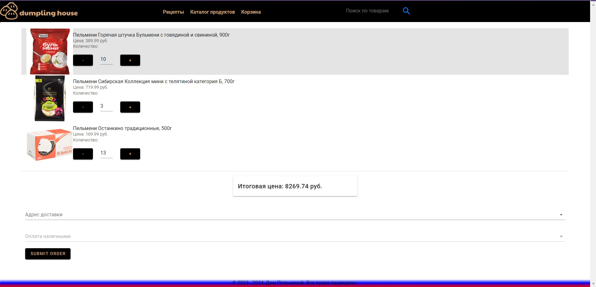

# Магазин Пельменей

Микросервисное веб-приложение для магазина пельменей с фронтендом на Vue.js и бэкендом на C#.

## Содержание
- [Описание](#описание)
- [Технологии](#технологии)
- [Установка](#установка)
- [Запуск](#запуск)

## Описание
Проект реализует многосервисную архитектуру для онлайн-магазина пельменей. Бэкенд состоит из независимых микросервисов:
- **ProductMicroservice** — управление каталогом пельменей и их характеристиками.
- **BasketMicroservice** — хранение и управление товарами в пользовательских корзинах с использованием Redis.
- **OrderMicroservice** — хранение заказов.
- **UserMicroservice** — регистрация, аутентификация и хранение данных пользователей.

Фронтенд построен на Nuxt.js (Vue.js) и включает страницы, компоненты, шаблоны, статические ресурсы, клиентские API для микросервисов, хранилище состояния и вспомогательные утилиты.

## Технологии
- Фронтенд:
  - Vue.js (42.5%)
  - SCSS (10.1%)
  - JavaScript (9.9%)
- Бэкенд:
  - C# (35.6%)
- Деплоймент:
  - Docker (1.9%)

## Установка

### Необходимые компоненты
- Node.js (последняя LTS-версия)
- .NET SDK
- Docker (опционально, для контейнерного деплоя)

### Установка фронтенда
1. Перейдите в директорию frontend:
```bash
cd frontend
```
2. Установите зависимости:
```bash
npm install
```

### Установка бэкенда
1. Перейдите в директорию backend:
```bash
cd backend
```
2. В каждом микросервисе выполните:
```bash
dotnet restore
```

## Запуск

### Режим разработки

#### Фронтенд
1. Запустите сервер разработки Vue.js:
```bash
npm run serve
```
Фронтенд будет доступен по адресу `http://localhost:8080`

#### Бэкенд
1. Запустите каждый микросервис отдельно:
```bash
dotnet run
```
API каждого сервиса будет доступен на соответствующем порту (например, `http://localhost:5000`).

### Использование Docker
Если вы предпочитаете использовать Docker:
```bash
docker-compose up --build
```
Это запустит все микросервисы и фронтенд в контейнерах.
